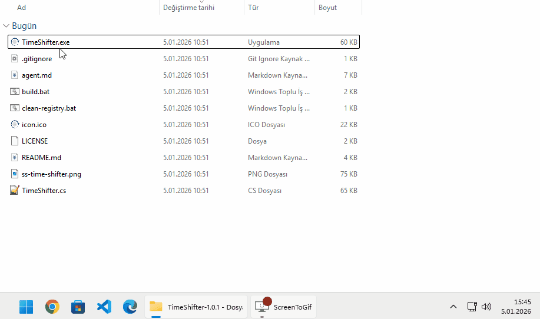

# TimeShifter

A Windows system tray application that temporarily shifts the system clock forward.

**[Türkçe](#türkçe)**

## Demo (GIF)

## Features

- **Tray Icon Status**:
  - Gray: Clock is normal
  - Red (with countdown): Clock is shifted forward
  - Yellow: 1 minute remaining warning

- **Time Shift Options**: 1 month, 3 months, or 1 year forward
- **Auto-reset Options**: 10 minutes, 30 minutes, 2 hours, or until end of day
- **Quick Action Panel**: Left-click the tray icon to open the quick settings panel
- **Smart Warning**: Shows a warning dialog 1 minute before auto-reset with option to extend
- **Additive Extension**: When extending time, the selected duration is added to the remaining time
- **Safe Exit**: Warns if clock is still shifted when exiting

## Usage

1. **Left-click** the tray icon to open the Quick Action panel
2. **Right-click** for the context menu with all options
3. Select shift amount and reset duration, then click "İleri Al" (Shift Forward)
4. When active, the icon shows remaining minutes (or hours for 100+ minutes)

## Requirements

- Windows 10/11
- .NET Framework 4.0+
- Administrator privileges (auto-prompted via UAC)

## Installation

### Option 1: Download Release (Recommended)
Download the latest `TimeShifter.exe` from [Releases](../../releases). If Windows shows a security warning, click "More info" and then "Run anyway" to proceed.

### Option 2: Build from Source Code
For users with security concerns or who want to verify the source code:

1. Download the `Source code (zip)` from [Releases](../../releases)
2. Extract the zip file
3. Run `build.bat` to compile `TimeShifter.exe`
4. Run the generated `TimeShifter.exe`

> **Note**: Building from source allows you to verify the code and create your own executable, which may avoid security warnings on domain-managed Windows 11 machines.

## How It Works

1. Stops the Windows Time service to prevent auto-sync
2. Shifts the system clock forward by the selected amount
3. Starts a countdown timer for auto-reset
4. When timer expires (or manually reset), restores the original time
5. Re-enables Windows Time service and forces NTP sync

## Registry Cleanup

To clean up registry entries, run `clean-registry.bat`. This removes:
- `HKEY_CURRENT_USER\Software\TimeShifter`
- TimeShifter entries in `HKEY_CURRENT_USER\Control Panel\NotifyIconSettings`

## License

MIT License - Feel free to use, modify, and distribute.

---

# Türkçe

Windows sistem saatini geçici olarak ileri alan system tray uygulaması.

## Özellikler

- **Tray İkon Durumu**:
  - Gri: Sistem saati normal
  - Kırmızı (geri sayım ile): Sistem saati ileri alınmış
  - Sarı: 1 dakika kaldı uyarısı

- **İleri Alma Seçenekleri**: 1 ay, 3 ay veya 1 yıl
- **Otomatik Sıfırlama**: 10 dakika, 30 dakika, 2 saat veya gün sonuna kadar
- **Hızlı Erişim Paneli**: Tray ikonuna sol tıklayarak ayarlar panelini açın
- **Akıllı Uyarı**: Sıfırlamadan 1 dakika önce uzatma seçeneği sunar
- **Toplamalı Uzatma**: Süre uzatıldığında seçilen süre kalan süreye eklenir
- **Güvenli Çıkış**: Sistem saati hâlâ ilerideyse çıkışta uyarı verir

## Kullanım

1. Tray ikonuna **sol tıklayın** → Hızlı Erişim paneli açılır
2. **Sağ tıklayın** → Tüm seçenekleri içeren menü
3. İleri alma miktarı ve sıfırlama süresini seçip "İleri Al" butonuna tıklayın
4. Aktifken ikon kalan dakikayı gösterir (100+ dakika için saat cinsinden)

## Gereksinimler

- Windows 10/11
- .NET Framework 4.0+
- Admin yetkisi (otomatik UAC)

## Kurulum

### Seçenek 1: Release İndir (Önerilen)
[Releases](../../releases) sayfasından son `TimeShifter.exe` dosyasını indirin. Windows güvenlik uyarısı gösterirse, "Daha fazla bilgi" ve ardından "Yine de çalıştır" seçeneğini tıklayın.

### Seçenek 2: Kaynak Koddan Derle
Güvenlik endişesi olan veya kaynak kodu doğrulamak isteyen kullanıcılar için:

1. [Releases](../../releases) sayfasından `Source code (zip)` dosyasını indirin
2. Zip dosyasını açın
3. `build.bat` dosyasını çalıştırarak `TimeShifter.exe` dosyasını derleyin
4. Oluşturulan `TimeShifter.exe` dosyasını çalıştırın

> **Not**: Kaynak koddan derleme, kodu doğrulamanıza ve kendi çalıştırılabilir dosyanızı oluşturmanıza olanak tanır. Bu, domain ile yönetilen Windows 11 makinelerinde güvenlik uyarılarını önleyebilir.

## Lisans

MIT Lisansı - Özgürce kullanın, değiştirin ve dağıtın.
